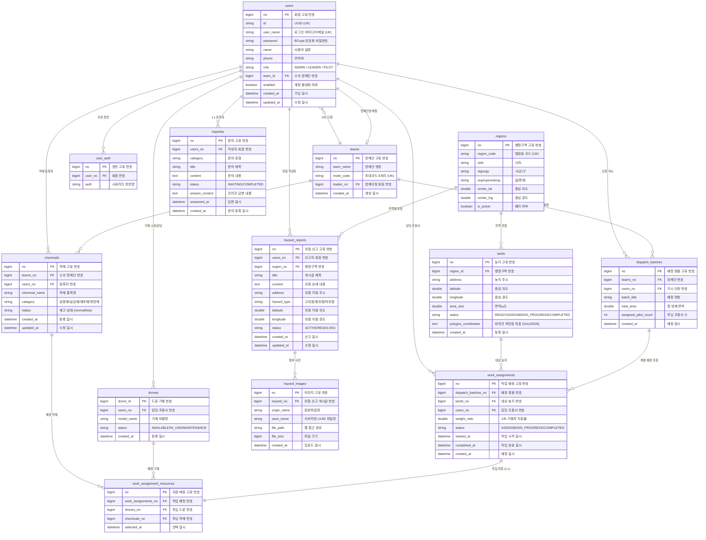

```mermaid
erDiagram
%% ==========================================
    %% 1. 회원 & 조직 (Users & Teams)
    %% ==========================================
    users {
        bigint no PK "회원 고유 번호"
        string id "UUID (UK)"
        string user_name "로그인 아이디/이메일 (UK)"
        string password "BCrypt 암호화 비밀번호"
        string name "사용자 실명"
        string phone "연락처"
        string role "ADMIN / LEADER / PILOT"
        bigint team_id FK "소속 방제단 번호"
        boolean enabled "계정 활성화 여부"
        datetime created_at "가입 일시"
        datetime updated_at "수정 일시"
    }

    teams {
        bigint no PK "방제단 고유 번호"
        string team_name "방제단 명칭"
        string invite_code "초대코드 6자리 (UK)"
        bigint leader_no FK "방제단장 회원 번호"
        datetime created_at "생성 일시"
    }

    user_auth {
        bigint no PK "권한 고유 번호"
        bigint user_no FK "회원 번호"
        string auth "시큐리티 권한명"
    }

    %% ==========================================
    %% 2. 농지 및 행정구역 (Lands & Regions)
    %% ==========================================
    regions {
        bigint no PK "행정구역 고유 번호"
        string region_code "법정동 코드 (UK)"
        string sido "시/도"
        string sigungu "시/군/구"
        string eupmyeondong "읍/면/동"
        double center_lat "중심 위도"
        double center_lng "중심 경도"
        boolean is_active "폐지 여부"
    }

    lands {
        bigint no PK "농지 고유 번호"
        bigint region_id FK "행정구역 번호"
        string address "농지 주소"
        double latitude "중심 위도"
        double longitude "중심 경도"
        double area_size "면적(㎡)"
        string status "READY/ASSIGNED/IN_PROGRESS/COMPLETED"
        text polygon_coordinates "외곽선 꼭짓점 좌표 (GeoJSON)"
        datetime created_at "등록 일시"
    }

    %% ==========================================
    %% 3. 작업 배정 및 자원 (Tasks & Resources)
    %% ==========================================
    dispatch_batches {
        bigint no PK "배정 묶음 고유 번호"
        bigint teams_no FK "방제단 번호"
        bigint users_no FK "지시 단장 번호"
        string batch_title "배정 명칭"
        double total_area "총 방제 면적"
        int assigned_pilot_count "투입 조종사 수"
        datetime created_at "배정 일시"
    }

    work_assignments {
        bigint no PK "작업 배정 고유 번호"
        bigint dispatch_batches_no FK "배정 묶음 번호"
        bigint lands_no FK "대상 농지 번호"
        bigint users_no FK "담당 조종사 번호"
        double weight_ratio "1/N 가중치 지분율"
        string status "ASSIGNED/IN_PROGRESS/COMPLETED"
        datetime started_at "작업 시작 일시"
        datetime completed_at "작업 완료 일시"
        datetime created_at "배정 일시"
    }

    drones {
        bigint drone_id PK "드론 기체 번호"
        bigint users_no FK "담당 조종사 번호"
        string model_name "기체 모델명"
        string status "AVAILABLE/IN_USE/MAINTENANCE"
        datetime created_at "등록 일시"
    }

    chemicals {
        bigint no PK "약제 고유 번호"
        bigint teams_no FK "소속 방제단 번호"
        bigint users_no FK "등록자 번호"
        string chemical_name "약제 품목명"
        string category "살충제/살균제/제초제/영양제"
        string status "재고 상태 (normal/low)"
        datetime created_at "등록 일시"
        datetime updated_at "수정 일시"
    }

    work_assignment_resources {
        bigint no PK "자원 매핑 고유 번호"
        bigint work_assignments_no FK "작업 배정 번호"
        bigint drones_no FK "투입 드론 번호"
        bigint chemicals_no FK "투입 약제 번호"
        datetime selected_at "선택 일시"
    }

    %% ==========================================
    %% 4. 위험 신고 및 고객센터 (Hazards & Inquiries)
    %% ==========================================
    hazard_reports {
        bigint no PK "위험 신고 고유 번호"
        bigint users_no FK "신고자 회원 번호"
        bigint region_no FK "행정구역 번호"
        string title "게시글 제목"
        text content "위험 상세 내용"
        string address "위험 지점 주소"
        string hazard_type "고위험/중위험/저위험"
        double latitude "위험 지점 위도"
        double longitude "위험 지점 경도"
        string status "ACTIVE/RESOLVED"
        datetime created_at "신고 일시"
        datetime updated_at "수정 일시"
    }

    hazard_images {
        bigint no PK "이미지 고유 번호"
        bigint hazard_no FK "위험 신고 게시글 번호"
        string origin_name "원본파일명"
        string save_name "서버저장 UUID 파일명"
        string file_path "웹 접근 경로"
        bigint file_size "파일 크기"
        datetime created_at "업로드 일시"
    }

    inquiries {
        bigint no PK "문의 고유 번호"
        bigint users_no FK "작성자 회원 번호"
        string category "문의 유형"
        string title "문의 제목"
        text content "문의 내용"
        string status "WAITING/COMPLETED"
        text answer_content "관리자 답변 내용"
        datetime answered_at "답변 일시"
        datetime created_at "문의 등록 일시"
    }

    %% ==========================================
    %% 엔티티 간 외래키(FK) 연관관계 선
    %% ==========================================
    teams ||--o{ users : "소속 단원"
    users ||--o| teams : "방제단장 매핑"
    users ||--o{ user_auth : "보유 권한"

    regions ||--o{ lands : "지역 관할"
    regions ||--o{ hazard_reports : "지역별 위험"

    teams ||--o{ dispatch_batches : "방제단 배정"
    users ||--o{ dispatch_batches : "단장 지시"

    dispatch_batches ||--o{ work_assignments : "개별 배정 포함"
    lands ||--o{ work_assignments : "대상 농지"
    users ||--o{ work_assignments : "담당 조종사"

    work_assignments ||--|| work_assignment_resources : "투입 자원 (1:1)"
    drones ||--o{ work_assignment_resources : "배정 기체"
    chemicals ||--o{ work_assignment_resources : "배정 약제"

    users ||--o{ drones : "기체 소유/담당"
    teams ||--o{ chemicals : "방제단 약제"
    users ||--o{ chemicals : "약제 등록자"

    users ||--o{ hazard_reports : "위험 작성자"
    hazard_reports ||--o{ hazard_images : "첨부 사진"

    users ||--o{ inquiries : "1:1 문의자"
```